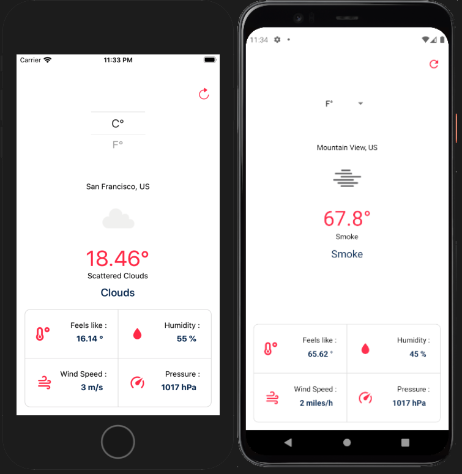

# react-native-simple-weather-app
react native simple weather app is a one pager weather app which pulls weather details from openweather website. Once user launches app in android or ios mobile phone, application will as for location data, if user allows, app will display weather details for that location. This repo is a good start for react native beginners. 

checkout app in expo [here](https://expo.io/@arifshariati/projects/react-native-simple-weather-app)
## screenshot

## install
get repository repo and install all dependencies (expo-cli and others, have a look at package.json)
then run `expo start` and connect to your simulators (ios / android) or your physical device by scaning barcode via expo app from your mobile. 

